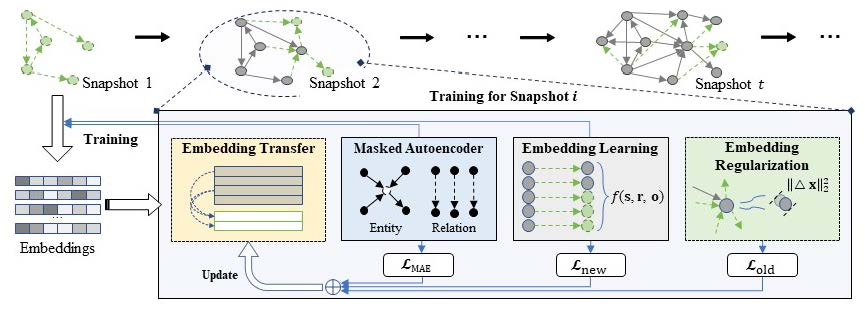

# Lifelong Embedding Learning and Transfer for Growing Knowledge Graphs

This is the official code release of the following paper: 

Yuanning Cui, Yuxin Wang, Zequn Sun, Wenqiang Liu, Yiqiao Jiang, Kexin Han, Wei Hu.[Lifelong Embedding Learning and Transfer for Growing Knowledge Graphs](https://arxiv.org/abs/2211.15845) AAAI 2023.

> Existing knowledge graph (KG) embedding models have primarily focused on static KGs. However, real-world KGs do not remain static, but rather evolve and grow in tandem with the development of KG applications. Consequently, new facts and previously unseen entities and relations continually emerge, necessitating an embedding model that can quickly learn and transfer new knowledge through growth. Motivated by this, we delve into an expanding field of KG embedding in this paper, i.e., lifelong KG embedding. We consider knowledge transfer and retention of the learning on growing snapshots of a KG without having to learn embeddings from scratch. The proposed model includes a masked KG autoencoder for embedding learning and update, with an embedding transfer strategy to inject the learned knowledge into the new entity and relation embeddings, and an embedding regularization method to avoid catastrophic forgetting. To investigate the impacts of different aspects of KG growth, we construct four datasets to evaluate the performance of lifelong KG embedding. Experimental results show that the proposed model outperforms the state-of-the-art inductive and lifelong embedding baselines.



## Quick Start

### Installation
Install PyTorch following the instructions on the [PyTorch](https://pytorch.org/).
Our code is written in Python3.

- pytorch=1.11.0
- pyg=2.0.4
- prettytable=3.3.0
- quadprog=0.1.11

### Dataset
```
unzip dataset.zip
```

It will generate four dataset folders in the ./data directory. In our experiments, the datasets used are: `ENTITY`, `RELATION`, `FACT` and `HYBRID`.
In each dataset, there are five folders for five snapshots.

### Training and evaluation
```
python main.py -dataset <dataset_name> -gpu <device_id> -lifelong_name <model_name>
```
In our experiments, the four datasets used are: `ENTITY`, `RELATION`, `FACT` or `HYBRID`. The models are `LKGE` or baseline models. 

### Change the hyperparameters
To change the hyperparameters and other experiment set up, start from the [parse_args files](src/parse_args.py) and [config files](src/config.py).
We have tuned hyperparameters for all models using grid-search and take the optimal implementation.

> If you have any difficulty or question in running code and reproducing experimental results, please email to yncui.nju@gmail.com.

## Citation
If you find the repository helpful, please cite the following paper
```bibtex
@inproceedings{cui2023lifelong,
  title = {Lifelong Embedding Learning and Transfer for Growing Knowledge Graphs},
  author = {Cui, Yuanning and 
            Wang, Yuxin and 
            Sun, Zequn and 
            Liu, Wenqiang and 
            Jiang, Yiqiao and 
            Han, Kexin and 
            Hu, Wei},
  booktitle = {AAAI},
  year = {2023}
}
```
